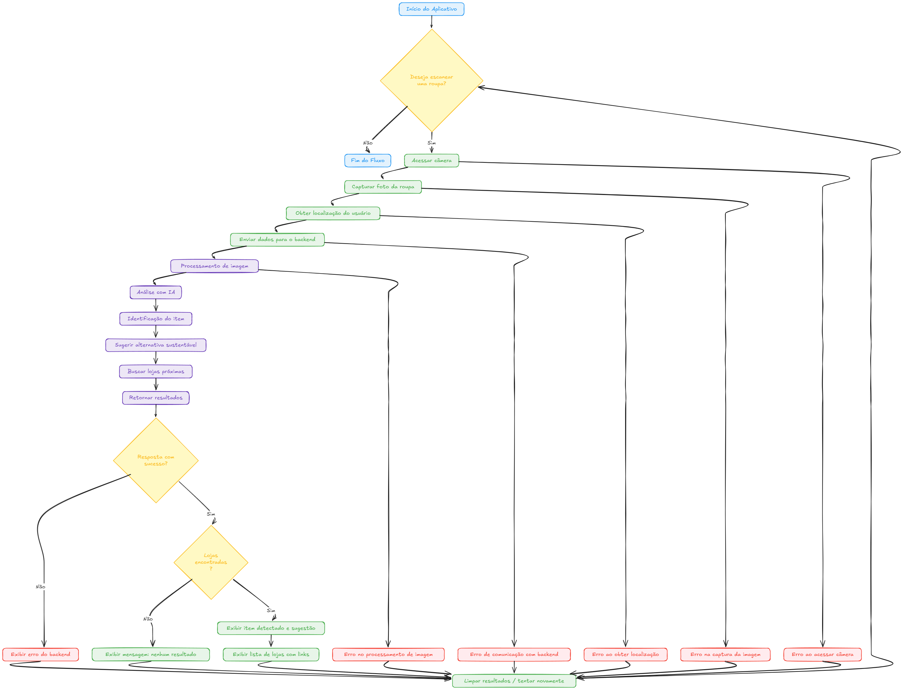

# Projeto EcoLook

## Visão Geral do Projeto

O EcoLook é um aplicativo que visa ajudar usuários a encontrar alternativas de moda mais sustentável e lojas próximas que vendem roupas ecológicas ou de segunda mão. Utilizando a câmera do celular, o aplicativo escaneia uma peça de roupa, identifica o tipo de peça com a ajuda da inteligência artificial (Google Gemini Vision), sugere uma alternativa sustentável e busca lojas próximas usando dados do OpenStreetMap.

Este projeto serve como uma prova de conceito para demonstrar a integração de IA de visão computacional, geolocalização e busca de dados de mapas em uma aplicação web progressiva.

## Funcionalidades

- **Escaneamento de Roupa:** Utilize a câmera do dispositivo para capturar uma imagem de uma peça de roupa.
    
- **Identificação de Peça:** O backend, utilizando Google Gemini Vision, analisa a imagem para identificar o tipo de peça (ex: camiseta, calça jeans, vestido).
    
- **Sugestão Sustentável:** Receba uma sugestão de alternativa de material ou prática sustentável relacionada à peça identificada.
    
- **Busca de Lojas Próximas:** Encontre lojas de moda sustentável ou brechós próximos à sua localização, utilizando dados do OpenStreetMap via Overpass API.
    
- **Modal "Sobre":** Informações sobre o aplicativo e suas funcionalidades (incluindo a nota sobre a busca de lojas via OSM).
    

## Tecnologias Utilizadas

**Frontend:**

- HTML5, CSS3
    
- JavaScript
    
- APIs do Navegador (Câmera, Geolocalização, Service Worker)
    

**Backend (API):**

- Python
    
- FastAPI (Framework web assíncrono)
    
- `python-dotenv` (para carregar variáveis de ambiente)
    
- `requests` (para fazer requisições HTTP)
    
- Google Generative AI SDK (`google-generativeai`) - Utilizado para integração com o modelo Gemini Vision.
    
- OpenStreetMap Overpass API - Utilizado para buscar dados de lojas.
    
## Fluxograma


## Como Configurar e Executar

Este projeto consiste em duas partes principais: o frontend (uma PWA estática) e o backend (uma API FastAPI).

### Configuração do Backend

1. **Clone o repositório (se aplicável) ou crie a estrutura de arquivos:** Certifique-se de ter os arquivos Python do backend (ex: `main.py`) e um arquivo `.env`.
    
2. **Instale as dependências:**
    
    ```
    pip install fastapi uvicorn python-multipart python-dotenv requests google-generativeai
    ```
    
3. **Obtenha uma Google API Key:** Você precisa de uma chave de API do Google Cloud para usar o modelo Gemini Vision. Crie um projeto no Google Cloud, habilite a Gemini API e gere uma chave.
    
4. **Crie um arquivo `.env`:** Na raiz do diretório do backend, crie um arquivo chamado `.env` com o seguinte conteúdo:
    
    ```
    GOOGLE_API_KEY='SUA_CHAVE_DE_API_AQUI'
    ```
    
    Substitua `'SUA_CHAVE_DE_API_AQUI'` pela sua chave de API do Google.
    
5. **Execute o servidor FastAPI:**
    
    ```
    uvicorn main:app --reload
    ```
    
    O backend estará rodando em `http://127.0.0.1:8000` por padrão.
    

### Configuração do Frontend

1. **Crie a estrutura de arquivos:** Tenha o arquivo HTML (ex: `index.html`) e o arquivo do Service Worker (ex: `service-worker.js`).
    
2. **Atualize a URL do Backend:** No arquivo JavaScript do seu frontend (no `index.html`), certifique-se de que a constante `BACKEND_URL` esteja apontando para o endereço e porta corretos do seu backend (ex: `const BACKEND_URL = 'http://127.0.0.1:8000';`).
    
3. **Sirva os arquivos estáticos:** Você precisa servir os arquivos HTML, CSS e JS (e o `manifest.json` e `service-worker.js` para a PWA) usando um servidor web local (como o Live Server do VS Code, `http-server` do npm, ou um servidor Python simples). Certifique-se de que o servidor esteja rodando em `http://127.0.0.1:<PORTA_DO_FRONTEND>` ou `http://localhost:<PORTA_DO_FRONTEND>`. A porta 5500 é comum para o Live Server.
    
4. **Acesse o Aplicativo:** Abra o frontend no seu navegador em um ambiente seguro (HTTPS ou localhost/127.0.0.1) para que o acesso à câmera e a geolocalização funcionem.
    

## Fluxo de Uso

1. Abra o aplicativo no navegador.
    
2. Permita o acesso à câmera e à geolocalização quando solicitado.
    
3. Posicione uma peça de roupa na frente da câmera.
    
4. Clique no botão "Escanear Roupa".
    
5. Aguarde enquanto a imagem é capturada, a localização é obtida, e os dados são enviados para o backend para análise e busca.
    
6. Visualize o item detectado, a sugestão sustentável e a lista de lojas próximas.
    
7. Clique em "Escanear Outra Roupa" ou "Limpar Resultados" para reiniciar.
    

## Limitações e Próximos Passos

**Limitações do MVP:**

- A busca de lojas utiliza dados do OpenStreetMap, que podem não ser tão completos quanto os do Google Maps em algumas regiões.
    
- A distância das lojas não é calculada/exibida (requer cálculo geodésico ou outra API).
    
- A sugestão sustentável é baseada em lógica simples no backend, não em uma análise aprofundada da peça pela IA.
    
- A implementação de Agentes Gemini para orquestração da busca é conceitual neste MVP.
    

**Possíveis Próximos Passos:**

- Melhorar a query Overpass API para buscar mais tipos de estabelecimentos sustentáveis.
    
- Implementar o cálculo de distância geodésica no backend.
    
- Integrar uma base de dados mais rica sobre materiais e práticas sustentáveis no backend (potencialmente usando dados coletados via scraping ético de fontes apropriadas).
    
- Explorar a implementação de um Agente Gemini mais completo no backend para orquestrar a análise e a busca.
    
- Adicionar mais funcionalidades de PWA (offline support avançado, notificações).
    
- Melhorar a UI/UX.
    
- Considerar a integração com a Google Places API (New) se os custos forem viáveis para obter dados mais completos e precisos (com faturamento configurado).
    

## Contribuição

Este é um projeto MVP para fins de demonstração. Contribuições são bem-vindas para evoluir o projeto!

## Licença

MIT